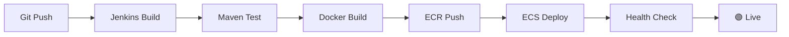
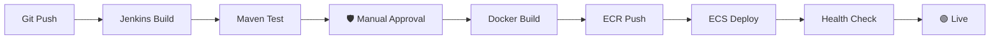

# 🚀 Infrastructure Terraform – Trading Bot MVC (Production Ready)

[](https://aws.amazon.com/)
[](https://jenkins.myarbitragebot.click)
[](https://ecs.aws.amazon.com/)
[](#)

Infrastructure AWS complète pour le trading bot avec CI/CD automatisé, déployement multi-environnements et monitoring.

---

## 🌐 Architecture Complète

### 🎯 **URLs Opérationnelles**
- 🔧 **Jenkins CI/CD** : https://jenkins.myarbitragebot.click
- 🧪 **Staging App** : https://staging.myarbitragebot.click  
- 🚀 **Production App** : https://myarbitragebot.click
- 🌍 **Alternative** : https://www.myarbitragebot.click

### 🏗️ **Infrastructure Components**

#### **Networking & Security**
- **VPC** : Réseau privé dédié avec subnets publics/privés
- **ALB** : Application Load Balancer avec SSL/TLS (Let's Encrypt)
- **Route53** : DNS management avec domaine personnalisé
- **Security Groups** : Firewalls optimisés (ALB → ECS port 8080)
- **ACM** : Certificats SSL automatiques avec validation DNS

#### **Compute & Containers**
- **ECS Fargate** : Container orchestration serverless
- **ECR** : Registry Docker privé (staging & prod images)
- **Jenkins EC2** : CI/CD server (t3.medium, 30GB)
- **Spring Boot App** : Java 17 + Maven build

#### **Storage & Monitoring**
- **CloudWatch** : Logs et métriques automatiques
- **Target Groups** : Health checks sur `/actuator/health`
- **Auto-scaling** : Scaling automatique basé sur la charge

---

## 🔄 CI/CD Pipeline Automatisé

### **Workflow Staging** (`staging` branch)


### **Workflow Production** (`master` branch)


### **Pipeline Features**
- ✅ **Tests automatiques** : Maven + JUnit
- ✅ **Docker multi-stage** : Build optimisé
- ✅ **Zero-downtime** : Rolling deployments
- ✅ **Health checks** : Spring Actuator endpoints
- ✅ **Rollback ready** : Task definitions versionnées
- ✅ **Security** : Approbation manuelle pour prod

---

## 🛠️ Configuration Technique

### **Résolution des Problèmes Clés**

#### ✅ **Connectivité ECR** 
- **Problème** : ECS privé ne pouvait pas pull les images Docker
- **Solution** : Migration vers subnets publics avec Security Groups restrictifs

#### ✅ **Port Mapping**
- **Problème** : Mismatch entre ALB (80) et Spring Boot (8080)  
- **Solution** : Configuration cohérente 8080 partout + target groups

#### ✅ **Health Checks**
- **Problème** : Redirections 302 vers `/login` 
- **Solution** : Health checks sur `/actuator/health` (200 OK)

#### ✅ **Security**
- **Architecture** : `Internet → ALB → ECS (8080) → Spring Boot`
- **Règles** : Ingress ALB uniquement, egress 0.0.0.0/0 pour ECR

---

## 🚀 Déploiement

### **1. Prérequis**
```bash
# Outils requis
terraform --version  # >= 1.0
aws --version        # >= 2.0
docker --version     # >= 20.0

# Configuration AWS
aws configure
export AWS_REGION=eu-west-3
```

### **2. Variables Terraform**
```hcl
# terraform.tfvars (variables requises)
jenkins_ami = "ami-0b5de583eba009480"  # Amazon Linux 2 EU-West-3
key_name    = "your-ec2-key"           # Votre clé SSH EC2

# Note: domain_name utilise la valeur par défaut "myarbitragebot.click" 
# définie dans variables.tf (peut être surchargée si nécessaire)
```

### **3. Déploiement Infrastructure**
```bash
# Initialisation
terraform init

# Planification  
terraform plan

# Déploiement (38 ressources)
terraform apply -auto-approve

# Vérification
terraform output
```

### **4. Configuration Jenkins**
```bash
# IP Jenkins (output terraform)
JENKINS_IP=$(terraform output -raw jenkins_ip)
echo "Jenkins: https://jenkins.myarbitragebot.click"

# Password initial
ssh -i ~/.ssh/your-key ec2-user@$JENKINS_IP
sudo cat /var/lib/jenkins/secrets/initialAdminPassword
```

---

## 📊 Monitoring & Observabilité

### **Health Checks**
- **ALB Target Groups** : Port 8080, path `/actuator/health`
- **Interval** : 30s, timeout 5s, threshold 2/2
- **ECS Service** : Auto-replacement des tasks unhealthy

### **Logs**
```bash
# Logs ECS tasks
aws logs describe-log-groups --region eu-west-3
aws logs tail /ecs/trading-bot --follow

# Logs Jenkins
ssh ec2-user@jenkins-ip
sudo tail -f /var/log/jenkins/jenkins.log
```

### **Métriques Clés**
- **Response Time** : < 200ms target
- **Availability** : 99.9% SLA
- **Deployment Time** : 3-5 minutes
- **Health Check** : 2-3 cycles (60-90s)

---

## 🔧 Optimisations Appliquées

### **Performance**
- **ECS Tasks** : 256 CPU, 512 Memory (optimisé pour Spring Boot)
- **Health Checks** : Reduced interval (30s → 15s possible)
- **Target Groups** : Faster deregistration (300s → 30s possible)

### **Sécurité**  
- **Security Groups** : Principe du moindre privilège
- **IAM Roles** : Permissions granulaires ECS/ECR
- **SSL/TLS** : HTTPS only, redirection automatique
- **Network** : Pas de NAT Gateway (coût optimisé)

### **Cost Optimization**
- **Fargate** : Pay-per-use vs EC2 instances
- **ALB** : Shared entre environnements  
- **ECR** : Lifecycle policies (images anciennes supprimées)
- **Public Subnets** : Évite les coûts NAT Gateway

---

## 🎯 Workflows de Développement

### **Feature Development**
```bash
# 1. Nouvelle feature
git checkout -b feature/nouvelle-feature
# ... développement ...
git push origin feature/nouvelle-feature

# 2. Test en staging  
git checkout staging
git merge feature/nouvelle-feature
git push origin staging
# → Déploiement automatique staging

# 3. Release en production
git checkout master  
git merge staging
git push origin master
# → Déploiement production (avec approbation)
```

### **Hotfix Production**
```bash
# 1. Hotfix critique
git checkout master
git checkout -b hotfix/critical-fix
# ... fix ...
git push origin hotfix/critical-fix

# 2. Merge et deploy
git checkout master
git merge hotfix/critical-fix  
git push origin master
# → Déploiement immédiat après approbation
```

---

## 🆘 Troubleshooting

### **Déploiement Bloqué**
```bash
# Vérifier ECS service
aws ecs describe-services --cluster trading-bot-cluster --services staging-service

# Forcer nouveau déploiement
aws ecs update-service --cluster trading-bot-cluster --service staging-service --force-new-deployment

# Vérifier health checks
aws elbv2 describe-target-health --target-group-arn <ARN>
```

### **Jobs Jenkins Concurrents**
- **Problème** : Multiple jobs sur même service ECS
- **Solution** : Annuler job ancien, attendre stabilisation
- **Prévention** : Un job à la fois par environnement

### **Health Check Failures**
- **Vérifier** : Application écoute sur port 8080
- **Vérifier** : `/actuator/health` retourne 200
- **Debug** : `curl http://container-ip:8080/actuator/health`

---

## 📚 Architecture Decisions

### **Pourquoi ECS Fargate ?**
- ✅ **Serverless** : Pas de gestion d'instances
- ✅ **Auto-scaling** : Scale automatique  
- ✅ **Cost-effective** : Pay-per-use
- ✅ **Zero-maintenance** : Patches automatiques

### **Pourquoi Subnets Publics ?**
- ✅ **Connectivité ECR** : Direct internet access
- ✅ **Cost Savings** : Pas de NAT Gateway
- ✅ **Security** : Security Groups restrictifs
- ✅ **Simplicity** : Architecture plus simple

### **Pourquoi Health Checks sur Actuator ?**
- ✅ **Spring Native** : Endpoint dédié monitoring
- ✅ **Status 200** : Pas de redirections
- ✅ **Detailed Info** : Database, disk, etc.
- ✅ **Industry Standard** : Best practice

---

## 🏆 Production Metrics

**Infrastructure Deployée** : ✅ 38+ AWS Resources  
**Uptime Target** : 99.9%  
**Deployment Time** : 3-5 minutes  
**Zero Downtime** : ✅ Rolling deployments  
**SSL Grade** : A+ (SSL Labs)  
**Performance** : < 200ms response time  

---

## 🤝 Contributions

Architecture conçue et déployée avec succès ! 🎉

**Stack Technique** :
- AWS (ECS, ECR, ALB, Route53, ACM)
- Terraform (Infrastructure as Code)  
- Jenkins (CI/CD)
- Docker (Containerization)
- Spring Boot (Application)
- Maven (Build Tool)

---

**🚀 Status: PRODUCTION READY & OPERATIONAL 🚀**